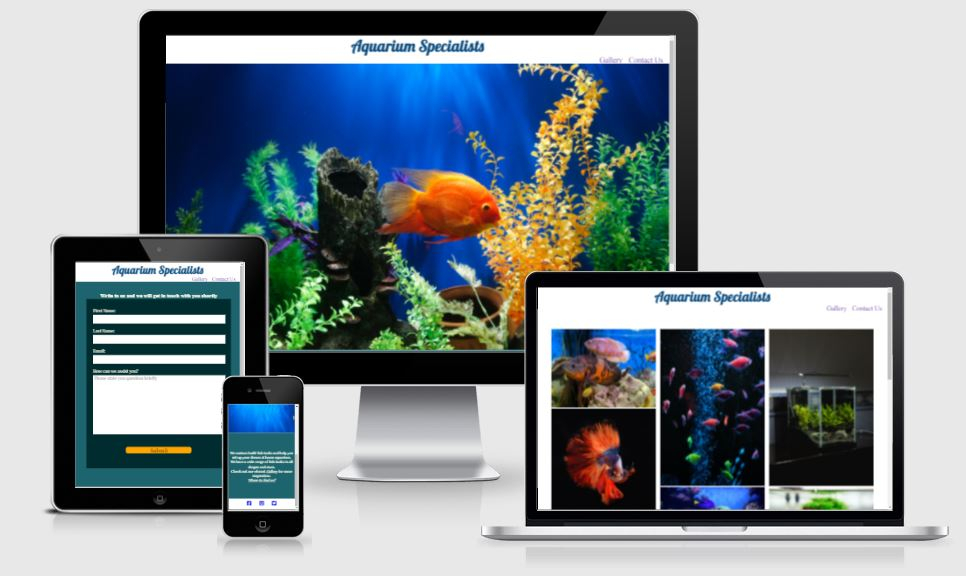
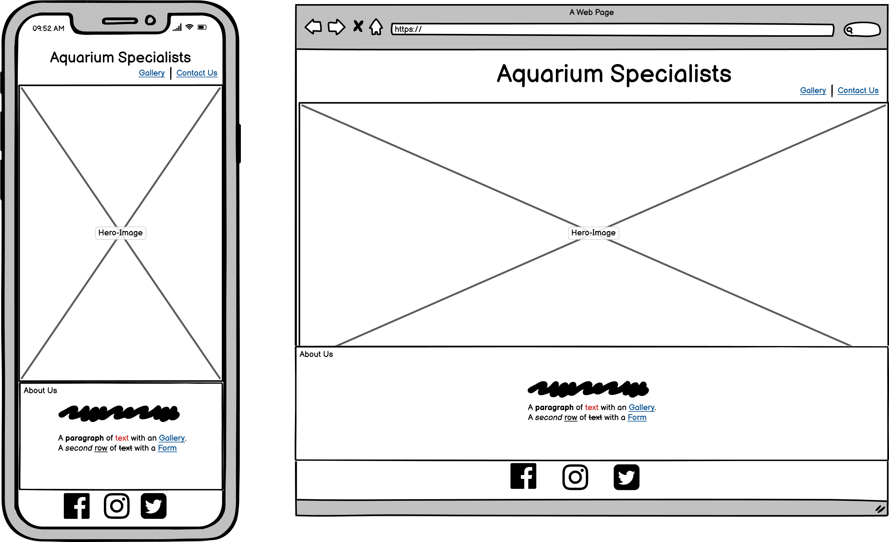
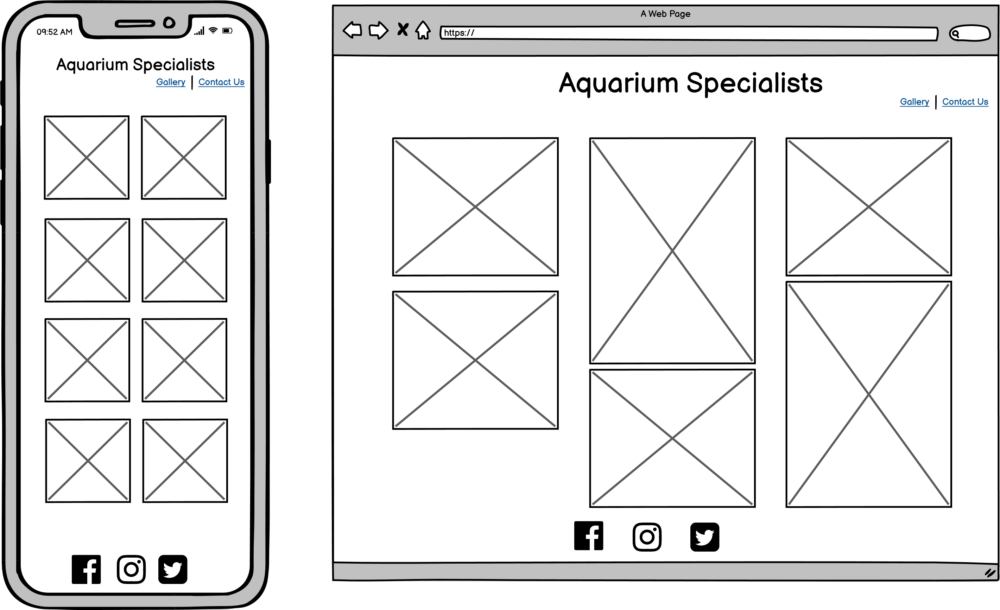
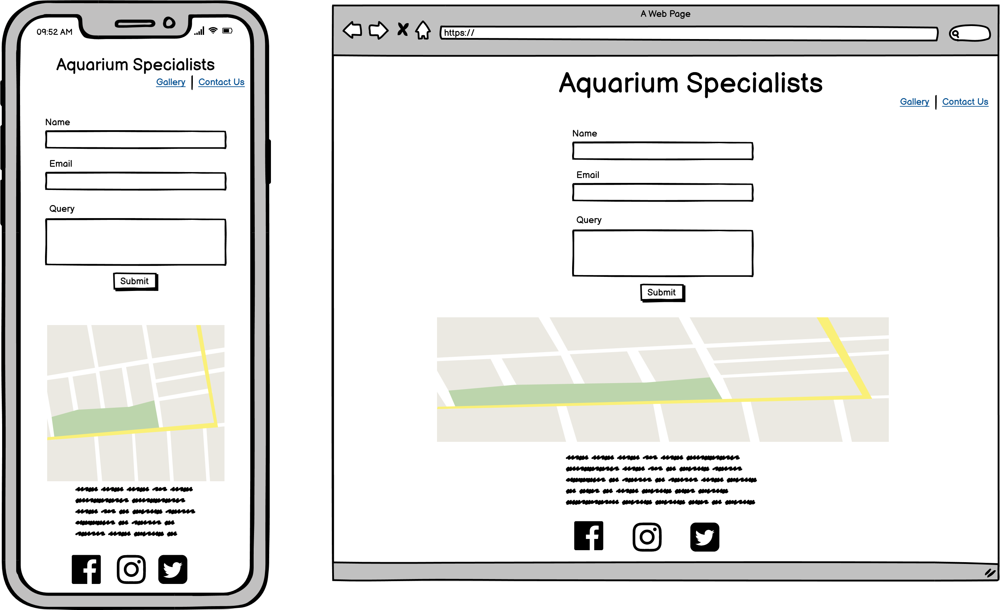

# Aquarium Specialists

A website for aquarium and fish tank lovers and hobbiests based in Limerick, Ireland. Website features a short summary about what the business does, a vibrant gallery portraying the businesses work and a contact page where customers can fill in their queries or visit the shop by looking at the map.

[View deployed site here](https://pradnya144.github.io/Portfolio-Project-1/)




## Table of Contents

* [User Experience (UX)](#User-Experience-(UX))
* [Design](#Design)
* [Features](#Features)
* [Technologies](#technologies)
* [Testing](#Testing)
* [Deployment](#Deployment)
* [Acknowledgements & Credit](#Acknowledgements-&-Credit)


## User Experience (UX)

### User Story

User stories were created to help guide the design and implementation phases of the project and to ensure the needs of each stake holder are undestood.

* Visitor Goals

    * As a visitor:
        * I want to know about the business.
        * I want to undertsand the services they offer.
        * I want to be able to see the kind of projects they have done before.
        * I want to be able to contact them.

* Business Owner Goals

    * As a business owner:
        * I want to more customers to find the business.
        * I want customers to check our projects.
        * I want customers to contact us.
        
### Structure

The website consists of 3 pages.

* A landing page/home page with a section having brief description of the business and links to the Photo Gallery and Contact form.
* A Gallery page displaying the highlights of the projects done by the business.
* A Contact page having a fill out form for enquiries and a map showing the location to the store along with store timings.


## Design

### Colour

Keeping in mind the purpose of this website, I have chosen colors close to the ocean and the beach. The background on most pages is Caribbean blue. I have used a font color similar to Ivory to give a good contrast. The fonts over white background is again a different sharde of blue, in orer to manintain contrast and the theme.
I knew I wanted to go with the whole water and ocean theme, so I used googles search engine to help me find some suitable color palettes.

### Font

I have used https://fonts.google.com/ for my fonts. I have chosen to use Playfair Display as my main font throughout the website. This is a fairly modern style that is easy to read at various sizes. To increase the readability, I have increased the font sizes at various occasions.

I have used the font Lobster in the header for the website name as it has an underwater kind of feel to it.

I imported the following code into the top of my style.css file

````
@import url('https://fonts.googleapis.com/css2?family=Lobster&display=swap&family=Playfair+Display&display=swap');
````

### Images

All the images for the website are from https://unsplash.com/. I wanted to keep the hero image very basic, yet very vibrant and inviting, with a large area of base color and not very cluttered. 

The I chose a variety of images for the gallery section, some with just planted fish tanks, some with fresh water fishes and some with marine fishes in order to try and display all the things this business offers.

### Wireframe

I have used balsamiq to create layout mockup of how the website would look. Being the developer and designer of the website, wireframes helped arrange different elements on the webpage to see what appeals the most visually.








## Features

## Technologies

### Languages used

* HTML5
* CSS3

### Frameworks, Libraries and Programs used

1. Google Fonts:
    * Google fonts import statements were used as part of this project to make use of the fonts which are used on all pages of the website.
2. Font Awesome:
    * Font Awesome was used on all pages of the website to add social media icons.
3. Gitpod:
    * Gitpod IDE was used for writing and editing code and version control.
4. GitHub:
    * GitHub is used to store the projects code after being pushed from Git.
5. Balsamiq:
    * Balsamiq was used to create the wireframes during the design phase.


## Testing

## Deployment

### Github Pages

This project was developed using the Gitpod IDE and pushed to a Github repository with the use of Git version control.
The project was deployed to GitHub Pages using the following steps.  
1. Login to Github and open the Github Repository.  
2. Within the Repository click on "Settings" from the top menu.  
3. Go to the "Pages" section.  
4. Under the Sources click the dropdown displaying None and select the branch to be deployed ("Main").  
5. Click on the "Save" button.  
6. Deployed link is now generated at the top.  

The website can directly be viewed using this link now.

### Forking Github Repository

To make a copy of the original repository to make changes to it without affecting the original repository follow the below steps.  
1. Login to Github and open the Github Repository.    
2. Within the Repository click on the "Fork" at the right top corner.   

This would have created the same repository in your account.  

 ### Cloaning Github Repository

 For creating a clone of this repository follow the below steps.  
1. Login to Github and open the Github Repository.  
2. Click on the Code dropdown above the file list.  
3. Copy the https link shown in the https section.  
4. Open your local terminal/command prompt where git is installed.  
5. Navigate to the location where you want to clone the repository.  
6. Type the command   
     ````
    git clone https://github.com/Pradnya144/Portfolio-Project-1.git
    ````   
The repository is cloned and ready to use.  


## Acknowledgements & Credits


